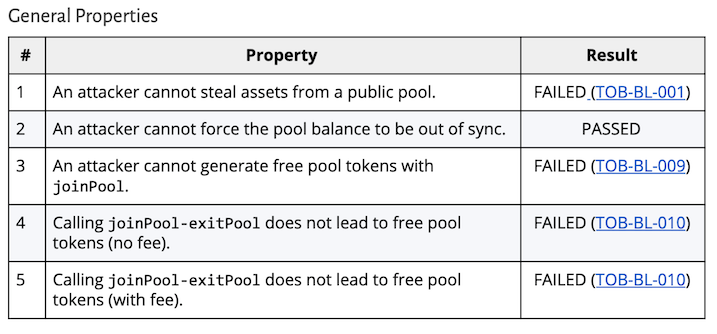
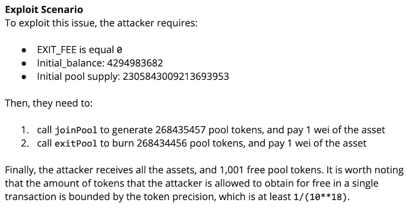
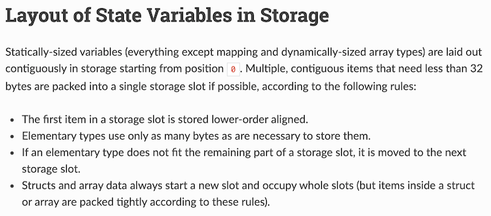
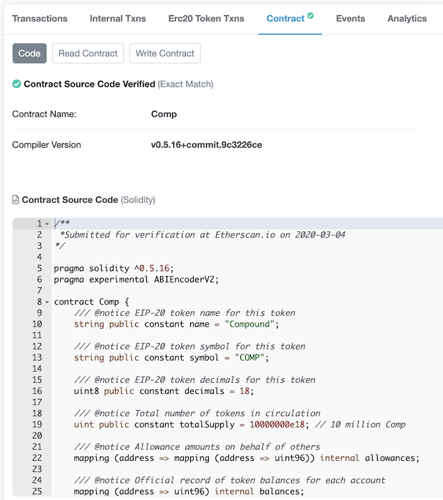
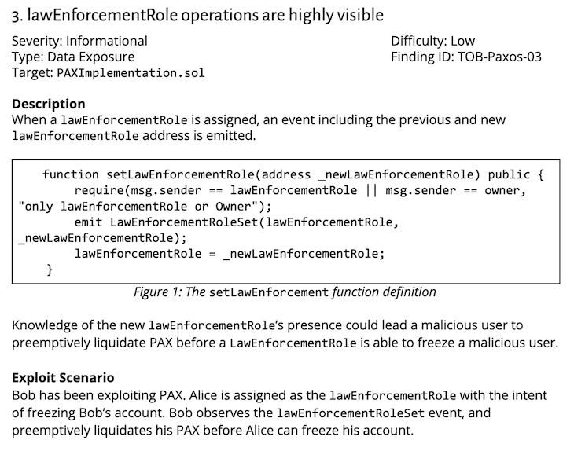

# The Good, The Bad, & The Blockchain
### a love story, in 17 parts

_starring Stefan Edwards, blockchain nihilist_

---

# outline

1. intro
1. take aways
1. definitions
1. the good
  1. formal methods
  1. semi-formal methods
  1. throw out the bad (Solidity => Vyper)
  1. community
1. the bad
  1. Solidity & YUL
  1. test environments
  1. costs (gas, &c)
1. the ugly
  1. TOCTOU
  1. off chain
  1. everything I don't like is traditional infosec

---

# take aways

.right[]

if you take anything away from this talk:

1. [NIST IR 8202](https://nvlpubs.nist.gov/nistpubs/ir/2018/NIST.IR.8202.pdf) is correct, you probably don't need blockchain
1. blockchain gets many things correct, some even better than traditional infosec
1. there are no golden roads to security, Consistency/Availability/Partition Tolerance (CAP), or correctness

---

# `$ finger lojikil`

```
[lojikil.com]
Stefan Edwards (lojikil) is not presently logged in.

- Practice Lead at Trail of Bits
- Twitter/Github/Lobste.rs: lojikil
- Works in: Defense, FinTech, Blockchain, IoT, compilers,
vCISO services, threat modeling
- Previous: net, web, adversary sim, &c. 
- Infosec philosopher, programming 
language theorist, everyday agronomer, father.
- As heard on Absolute AppSec (multiple) and Risky
Business (No. 559).

WARNING: DEAF
WARNING: Noo Yawk
```

---

# Trail of Bits

- large number of smart contract assessments (5-10 *per month*)
- large number of bespoke blockchain assessments (~ 5 *per year*)
- work on tools like Manticore (symbex), Echidna (property testing), Slither (static analysis & absint)
- surrounding areas: cryptography, infra, &c

_publications: github.com/trailofbits/publications_

---

# what do I mean by "blockchains"

- most folks: money, maybe distributed state
- me: consensus algorithms, VMs, smart contracts, storage, money, governance, ...
- read: this is complex

---

# attacks occur at all levels

- [Geth recently had a VM bug that caused a partial chain split](https://gist.github.com/karalabe/e1891c8a99fdc16c4e60d9713c35401f)
- [Various network-level attacks against Pantheon](https://github.com/trailofbits/publications/blob/master/reviews/pantheon.pdf)
- [Yam Finance missed a divison operation and lost $500m](https://cointelegraph.com/news/how-one-line-of-code-destroyed-yam-defi)
   - `totalSupply = initSupply.mul(yamsScalingFactor)`
   - they forgot to add `.div(BASE)`

---

# definitions

## for this talk, there are two major concepts we need to understand

- blockchains, and some terms around them
- formal methods

---

# blockchains

- basically:
  - some consensus algorthim *PLUS*
  - some storage system *PLUS*
  - some validation system *AND OFTEN PLUS*
  - some virtual machine, wire protocol, &c.

---

# definitions

- at their core, blockchains are state machines
- consensus: a mechanism for replicating states
- many different types:
  - Byzantine Fault Tolerance
  - Proof of Work (`I calculated this big number to show I am correct`)
  - Proof of Stake (`I have this much money to show I am correct`)
  - Proof of Authority (`Dude, you know me, I'm good for it...`)
    - often combined with another algorithm, for actual consensus
- basically: we need to take state of current world, and derive new world from it, with minimal trust

---

# definitions: let's build a simple blockchain

## all we need is:

- Some function `H`
- Some key `K`
- a calculated result: `H(K, data) == some unique value`
- Blockchains: repeated applications of `H` over new data
- including previous data

---


---

# defintions: let's build a simple blockchain

## lojichain satisfies the above:

- consensus algorithm: proof of authority + sole source
- storage system: simple linked list of nodes
- validation system: easily check that items were signed/HMAC'd with my key

---


---

# definitions: quite old concepts

- Merkle Trees (1979)
    - most blockchains use some form of Hash Tree like Merkle
    - some use AVL trees that have been Merkle-ized
- Linked-Time Stamps (1992)
- Direct Acyclical Graphs (< 1960's)
- basically: we hash some stuff and socialize it

---

# definitions: consensus


---

# definitions: consensus


---

# definitions: formal methods

## the other new concept is...

- blockchain makes use of formal and semi-formal methods
- symbolic execution: a group of techniques for exploring the state space of a program
- abstract interpretation: explores the abstract domain of program values
- program analysis: understanding the constraints under which a program executes
- bounded modeling: checking if the state flow of a program matches the specification
- specification: a mathematical description of the program flow
- property testing: random testing (ala fuzzing) of program invariants
- invariants: conditions that must be satisfied regardless of current program state
- others: design by contract

---

# whoa, wtaf

- it sounds harder than it is
- basically, a group of techniques to say "we can check what our programs are doing"
- old techniques, that blockchain is uniquely suited to
    1. we know when things terminate
    1. we can analyze things under fixed conditions
    1. better for analysis than simple unit testing

---

# the good

1. blockchain has shown it's possible to use formal methods
    - these techniques aren't only useful to NASA & car manufacturers
1. Even semi-formal methods (like DbC + invariants + fuzzing) can get huge wins
1. a willingness to throw out the bad

---

# the good: formal methods

- last time you saw formal methods?
- we have clients that come to us with:
    1. unit  tests
    1. bespoke fuzzers
    1. symbolic execution traces
- and now want assessments
- formal methods are no longer exotic
  - regular folks can use them 
  - with a pleathora of options

---

# the good: formal methods

- Let's look at two public reports:
  - https://github.com/trailofbits/publications/blob/master/reviews/0x-protocol.pdf
      - an exchange that allows users to stake & withdraw funds
  - https://github.com/trailofbits/publications/blob/master/reviews/BalancerCore.pdf
      - a portfolio manager & price sensor
- Both fairly non-trivial:
  - complex maths
  - complex user interactions 
- generally outside the domain of tooling

---

# the good: formal methods

### what did we get?

- multitude of invariants
- automatic test cases
- on code bases that were well tested



---

# the good: formal methods

### what did the client get?

- greater insight into numerical accuracy of their code
- test cases that can now become invariants that should always hold



---

# the good: formal methods

- this is not to say everything is rosy
  - there are limits to formal methods
  - can still have blind spots or issues
- gain insight
- lots of innovation in the space:
  - Trail of Bits: Manticore, Echidna, Slither
  - Consensys: MythX, lots of greybox fuzzing
  - Runtime Verification: K framework, [Firefly](https://runtimeverification.com/firefly/) 
    - side note: Firefly looks *extremely*  interesting
- without requiring a huge lift
  - Slither: seconds
  - Echidna: hours
  - Manticore: days

---

# the good: semi-formal methods

- semi?
  - may have limitations in it's model
  - may have limitations in it's testing
  - may not be holistically applied
  - still provides value
- let's look at Tendermint's _invariants_
  - blockchain framework & stand-alone blockchain (via Cosmos)
  - remember: an invariant is just some property we wish to always hold

---

# the good: semi-formal methods

- Invariants in Tendermint are just functions:

```
// NonnegativeBalanceInvariant checks that all accounts in the application have non-negative balances
func NonnegativeBalanceInvariant(ak types.AccountKeeper) sdk.Invariant {
	return func(ctx sdk.Context) (string, bool) {
		var msg string
		var count int

		accts := ak.GetAllAccounts(ctx)
		for _, acc := range accts {
			coins := acc.GetCoins()
			if coins.IsAnyNegative() {
				count++
				msg += fmt.Sprintf("\t%s has a negative denomination of %s\n",
					acc.GetAddress().String(),
					coins.String())
			}
		}
		broken := count != 0

		return sdk.FormatInvariant(types.ModuleName, "nonnegative-outstanding",
			fmt.Sprintf("amount of negative accounts found %d\n%s", count, msg), broken)
	}
}
```
- here: just check that  all accounts have non-negative balances
- possibly: [anywhere that a developer suspects we need a simple check](https://docs.cosmos.network/master/building-modules/invariants.html)

---

# the good: semi-formal methods

### what do we get?

- quick read of good paths
- focus on paths that may not have invariants
- known-good transaction states
- greater insight than tests:
    - violations are instantly logged with source and condition
- fuzzing can spot:
  - new areas for invariants
  - invariants that can be moved up

---

#  the good: semi-formal methods

## as an aside

- if you think "that's just an assert!" you're absolutely correct
- `assert` is just an invariant
- can be used for the same purposes
- but obviously with more machinery  vis-a-vis logging, source, context, &c

---

# the good: semi-formal methods

### what do they get

- [formalized attack scenarios](https://docs.tendermint.com/master/spec/light-client/accountability.html)
    - block & chain state
    - in central locations
    - with central application
    - in a convienent fashion
- [stronger touch points wrt remediation](https://github.com/cosmos/cosmos-sdk/issues/4795)
    - remediation is straight forward: strengthen invariant, add test case
    - users of Tendermint can expand as needed
    - all from a cheap & central system

---

# the good: throw out the bad (Solidity => Vyper)

- Solidity is... interesting
- lots of odd design choices
- probably the largest impact of smart contract vulns
- "all the problems of C combined with all the problems of JavaScript"

---

# the good: throw out the bad (Solidity => Vyper)

- in a normal env, you're stuck
  - when was your last successful lift & shift to a new language?
- in blockchain: experiment with a new language
- Vyper:
  - fixes maths issues that plague Solidity
  - introduces a tighter security model
  - actually enforces it's claims

---

# the good: throw out the bad (Solidity => Vyper)

- quick question: what does `u + 1` do?

---

# the good: throw out the bad (Solidity => Vyper)

- answer: depends on solidity version, the type of `u`, &c
- *OLD* Solidity:

```
uint i = 1;
var j = 2;
var k = i - j;
```

- `k` is... `115792089237316195423570985008687907853269984665640564039457584007913129639935`

```
uint i = 0xdeadbeef;
for(var j = 0; j < i; j++) {
    // ...
}
```

- `j` is narrowed to a `uint8`
- therefore `0 <= j <= 255`
- `255 < 0xdeadbeef`
- therefore, loop exhaustion

---

# the good: throw out the bad (Solidity => Vyper)

- common remediation: use `SafeMath`
- common remediation: use `pure` modifier
- common remediation: don't use certain solidity features
- ...
- Vyper took community feedback, and packaged it into a smaller, safer language

---

# the good: throw out the bad (Solidity => Vyper)

### what do we get?

- simpler language, easier to analyze, fewer bugs
- avoid recommending the same fixes over and over
  - built in SafeMath
- people actually use it
  - sometimes in surprising ways: since Vyper is closer to Python, folks sometimes lift Solidity to Vyper, and then do analysis on Python

```
@external
def received():
    # 1. Conditions
    assert not self.unlocked # Is the item already purchased and pending
                             # confirmation from the buyer?
    assert msg.sender == self.buyer
    assert not self.ended

    # 2. Effects
    self.ended = True

    # 3. Interaction
    send(self.buyer, self.value) # Return the buyer's deposit (=value) to the buyer.
    selfdestruct(self.seller) # Return the seller's deposit (=2*value) and the
                              # purchase price (=value) to the seller.
```

---

# the good: community

- the community is *very* open
  - reports are public
  - all on chain code is public
  - many systems have audits by the same firms
- competition is healthy: enough firms in the space
- but collaboration is possible: working with competitors in ways traditional infosec never could
- Lots  of open resources:
  - https://github.com/crytic/not-so-smart-contracts
  - https://swcregistry.io/

---

# the bad

- Solidity & YUL
- Test Environments
- Costs

_beware ye who enter here looking for light_

---

# the bad: Solidity & YUL

- Solidity is... interesting (x2)
   - integers range from 8 to 256 bits
   - includes modifiers (decorators/annotations/attributes) that may not be applied
   - downright surprising semantics
   - ... and inline assembly?
- lots of compiler bugs:
   - previously used to exponentiate constants
   - lots of optimizer bugs
   - because of niche, main devs don't always need the same features normal users do
- result?
   - beware updating solc versions
   - beware optimizing solidity
   - beware of variable layout, type, usage, access
   - always test as much as possible on actual bytecode

---

# the bad: Solidity & YUL

- ok, that sounds bad..
- it's worse:
  - Solidity requires you know the storage layout
  - easy to accidentally step on your own toes



---

# the bad: Solidity & YUL

- [yes, if you guessed that this means your code might overrun, you're correct](https://blog.soliditylang.org/2020/04/06/memory-creation-overflow-bug/)
- [or otherwise  corrupt  storage...](https://www.certora.com/blog/corruptedStorage.html)

```
contract CorruptedState {
	struct Container {
		uint bigValue;
	}
	bytes bytesField;
	function corruptStorage() public returns (uint256) {
		bytes memory d = new bytes(0);
		Container memory f;
		f.bigValue = type(uint).max;
		bytesField = d;
		return f.bigValue;
	}

	function surprising() public returns (bytes1) {
		bytesField.push();
		return bytesField[0];
	}

	/*
	  NOTE: Included only to show low-level representation in storage, inline
	  assembly is NOT necessary to trigger the bug.
	*/
	function getRawSlot() public view returns (uint256 ret) {
		assembly {
		ret := sload(0)
		}
	}
}
```

---

# the bad: Solidity & YUL

```
In particular, the Solidity compiler generates a check to see if the length of the array is less than 32.
If not, the generated code falls back on the unpacked representation. Unfortunately, it is only after
Solidity checks if the length is greater than 32 does it check if the length is zero, which at that point
is an impossibility. If, however, the length is 31 or less, the generated code will enter a branch that
uses the packed representation.
```

- recent compiler bugs
- developers have to be aware  of _very low level implementation details_ in order to code safely
- effectively untennable 

---

# the bad: Solidity & YUL

### what does that give us?

- low-level language
- with difficult semantics
  - many analyses need to understand type widening
  - also need to understand & model memory layout
  - *and* need to model Keccak256 for Addressing
  - with 256bit integers 
- poor parsing
- lots of edge cases
- and a... difficult... compiler

---

# the bad: test environments

- most blockchains are non-trivial to stand up
  - focused on specialized operators 
  - lots of components and configuration knobs
  - individual smart contract devs aren't necessarily devops folks
  - may not have infrastructure to stand up a whole blockchain
- Ethereum is no different
- solution? use a pre-existing _test  net_
- basically: a public internet with similar rules to mainnet, but can be reset/destroyed/&c whenever

---

# the bad: test environments

### what does that give us?

- some clients test in prod (i.e. mainnet)
- some clients stand up nodes but don't have them configured correctly for what mainnet looks like
- some clients test in testnet... and expose keys or other secrets not realizing that blockchains are completely open
- we also in the past attempted to rerun all previous transactions...
  - it failed
- devs basically have to deploy to an open, prod-like env in order to test
  - and hope it doesn't reveal too much information

---

# the bad: costs (gas, &c)

- first a definition: blockchains run on money. literally
- all transactions require some fee to be paid, atop electricity costs &c
- these costs can rise _rapidly_ in blockchains, depending on blockheight, block density, &c
- in Ethereum, these costs are generally called "gas" and measured in giga-Wei (G-Wei)
  -  `1 eth == 10**18 Wei`
- all transactions, deployments, function calls, money sends, cost  money
---

# the bad: costs (gas, &c)

### yes, you read the correctly: you literally burn cash to work with code on blockchains

---

# the bad: costs (gas, &c)

### what does that give us?


_source: https://etherscan.io/gastracker_

- yes, that's ~558,000 USD in the last 24 hours
- it seems obvious, but wildly successful contracts can cost a *lot* more than you may expect
- *furthermore* unoptimized code _literally costs you money_
  - it also leads clients into all sorts of bespoke languages...

---

# the ugly: TOCTOU

[_extreme Gary Bernhardt voice_](https://www.destroyallsoftware.com/talks/wat): enough about languages that suck, let's talk about Solidity

- as if there weren't enough footguns, Solidity is _reentrant_
- certain operations return control to other contracts
- these contracts may call back to your contract
  - this kills the ~~crab~~ contract

```
function withdrawBalance(){
    // send userBalance[msg.sender] ethers to msg.sender
    // if mgs.sender is a contract, it will call its fallback function
    if( ! (msg.sender.call.value(userBalance[msg.sender])() ) ){
        throw;
    }
    userBalance[msg.sender] = 0;
}
```
---

# the ugly: TOCTOU

```
function launch_attack() public{
    // call withdrawBalance
    // withdrawBalance calls the fallback of ReentranceExploit
    require(vulnerable_contract.call(bytes4(sha3("withdrawBalance()"))));
}


function () public payable{
    require(vulnerable_contract.call(bytes4(sha3("withdrawBalance()"))));
}
```

1. attacker calls `launch_attack`, which calls `vulnerable_contract.withdrawBalance`
1. `vulnerable_contract.withdrawBalance` calls the attacker with `msg.sender.call.value`
1. this calls the attacker's "fallback" function (denoted with `function ()` above) with funds
1. the attacker's fallback again calls the `vulnerable_contract.withdrawBalance` function
1. this continues until the attacker has drained all funds

---

# the ugly: TOCTOU

### where does that leave us?

- use the check-effects-interaction pattern:
```
function withdrawBalance_fixed(){
    uint amount = userBalance[msg.sender];
    userBalance[msg.sender] = 0;
    if( ! (msg.sender.call.value(amount)() ) ){
        throw;
    }
}
```
- use `send` and `transfer`:
```
    function withdrawBalance_fixed_2(){
        msg.sender.transfer(userBalance[msg.sender]);
        userBalance[msg.sender] = 0;
    }
```
- cry deeply
  - (it's extremely common)

---

<!-- JS components & integers, floats to Solidity floats, NTP at block level -->

# the ugly: off chain

- repeat after me: 
  - you can't do everything on the blockchain
  - nothing on the blockchain is secret
  - anything can be front run
  - environments can and will impact your blockchain & smart contract

---

# the ugly: off chain



---

# the ugly: off chain



---

# the ugly: off chain

### where does that leave us?

- you have to decide, up front, what is done on chain
  - great for data stores, announcing
- everything else must be off-chain
  - must match semantics
  - remember: solidity has 256 bit integers and fixed-point math (sorta)
  - also, good luck with time (NTP attacks, smearing, other issues)
- cannot stress enough: up front design, intention, and specification

---

# the ugly: everything I don't like is traditional infosec

### dawn of the final ugly thing

_these are all hottakes_

- there is *nothing* special about blockchain
- still have keys, still have funds, still need policies & playbooks
  - still have people to blackbag, intimidate, attack
- **furthermore**  there  is nothing special about blockchain infosec
  - risk rating is risk rating, IA is IA
- more orgs need to think about where keys live
  - and the answer is not "on GitHub"
- furthermore, monitoring for key activity, both on and off chain
  - having playbooks for when things go wrong
  - processes to monitor and alert when something does

---

# the ugly: everything I don't like is traditional infosec

### where does that leave us?

- _SEC has entered the chat_
- sooner or later this will be nationally regulated 
- states like NY already have some requirements:
  - Regulation 23 NYCRR Part 200 (BitLicense)     
  - NYCRR 500 (Cybersecurity requirements for financial services companies)
    - this is actually a pretty basic checklist
- adapting now, esp lightweight regulatory frameworks like what NY is pushing is easy
  - esp compared to  later

---

# fin

- Thank you!
- Questions?
