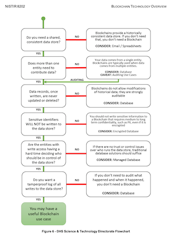
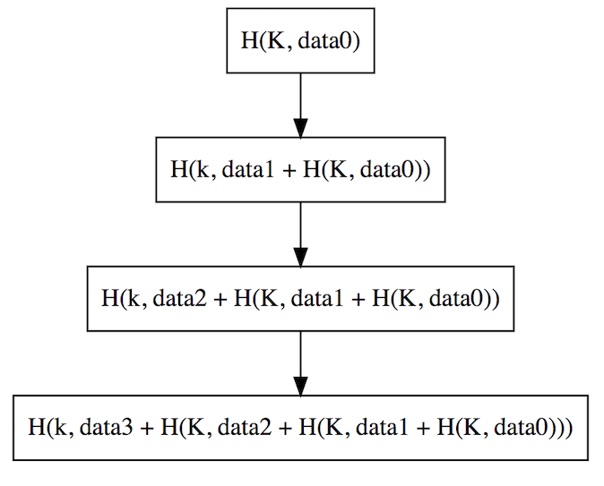
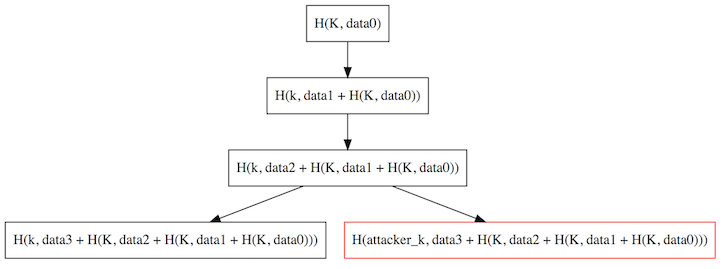
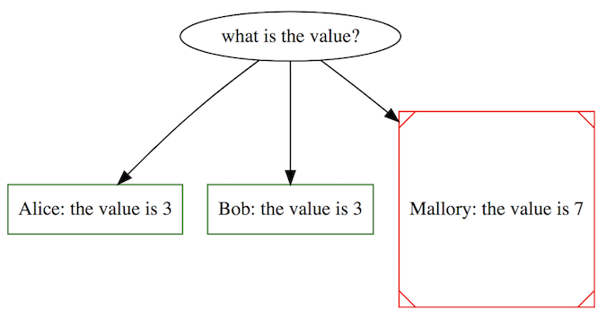
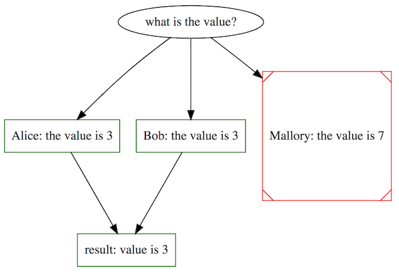

# The Good, The Bad, The Blockchain
## a love story

---

# outline

1. intro
1. take aways
1. definitions
1. the good
    1. formal modeling
    1. testing
    1. specification
1. the bad
    1. the money
    1. the price
    1. the tools
1. the ugly
    1. reentracy, a ballad of TOCTOU
    1. precision, numerics, and you
    1. infosec still counts

---

# take aways

.right[]

if you take anything away from this talk:

1. [NIST IR 8202](https://nvlpubs.nist.gov/nistpubs/ir/2018/NIST.IR.8202.pdf) is correct, you probably don't need blockchain
1. blockchain gets many things correct, some even better than traditional infosec
1. there are no golden roads to security, Consistency/Availability/Partition Tolerance (CAP), or correctness

---

# `$ finger lojikil`

```
[lojikil.com]
Stefan Edwards (lojikil) is not presently logged in.

- Practice Lead at Trail of Bits
- Twitter/Github/Lobste.rs: lojikil
- Works in: Defense, FinTech, Blockchain, IoT, compilers,
vCISO services, threat modeling
- Previous: net, web, adversary sim, &c. 
- Infosec philosopher, programming 
language theorist, everyday agronomer, father.
- As heard on Absolute AppSec (multiple) and Risky
Business (No. 559).

WARNING: DEAF
WARNING: Noo Yawk
```

---

# Trail of Bits

- large number of smart contract assessments (5-10 *per month*)
- large number of bespoke blockchain assessments (~ 5 *per year*)
- work on tools like Manticore (symbex), Echidna (property testing), Slither (static analysis & absint)
- surrounding areas: cryptography, infra, &c

_publications: github.com/trailofbits/publications_

---

# what do I mean by "blockchains"

- most folks: money, maybe distributed state
- me: consensus algorithms, VMs, smart contracts, storage, money, governance, ...
- read: this is complex

---

# definitions

## for this talk, there are two major concepts we need to understand

- blockchains, and some terms around them
- formal methods

---

# blockchains

- basically:
  - some consensus algorthim *PLUS*
  - some storage system *PLUS*
  - some validation system *AND OFTEN PLUS*
  - some virtual machine, wire protocol, &c.

---

# definitions

- at their core, blockchains are state machines
- consensus: a mechanism for replicating states
- many different types:
  - Byzantine Fault Tolerance
  - Proof of Work (`I calculated this big number to show I am correct`)
  - Proof of Stake (`I have this much money to show I am correct`)
  - Proof of Authority (`Dude, you know me, I'm good for it...`)
    - often combined with another algorithm, for actual consensus
- basically: we need to take state of current world, and derive new world from it, with minimal trust

---

# definitions: let's build a simple blockchain

## all we need is:

- Some function `H`
- Some key `K`
- a calculated result: `H(K, data) == some unique value`
- Blockchains: repeated applications of `H` over new data
- including previous data

---



---

# defintions: let's build a simple blockchain

## lojichain satisfies the above:

- consensus algorithm: proof of authority + sole source
- storage system: simple linked list of nodes
- validation system: easily check that items were signed/HMAC'd with my key

---



---

# definitions: quite old concepts

- Merkle Trees (1979)
    - most blockchains use some form of Hash Tree like Merkle
    - some use AVL trees that have been Merkle-ized
- Linked-Time Stamps (1992)
- Direct Acyclical Graphs (< 1960's)
- basically: we hash some stuff and socialize it

---

# definitions: consensus



---

# definitions: consensus



---

# definitions: formal methods

## the other new concept is...

- blockchain makes use of formal and semi-formal methods
- symbolic execution: a group of techniques for exploring the state space of a program
- abstract interpretation: explores the abstract domain of program values
- program analysis: understanding the constraints under which a program executes
- bounded modeling: checking if the state flow of a program matches the specification
- specification: a mathematical description of the program flow
- property testing: random testing (ala fuzzing) of program invariants
- invariants: conditions that must be satisfied regardless of current program state
- others: design by contract

---

# whoa, wtaf

- it sounds harder than it is
- basically, a group of techniques to say "we can check what our programs are doing"
- old techniques, that blockchain is uniquely suited to
    1. we know when things terminate
    1. we can analyze things under fixed conditions
    1. better for analysis than simple unit testing

---

# the good

1. blockchain has shown it's possible to use formal methods
    - these techniques aren't only useful to NASA & car manufacturers
1. Even semi-formal methods (like DbC + invariants + fuzzing) can get huge wins
1. a willingness to throw out the bad
